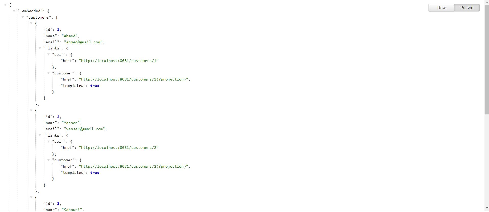
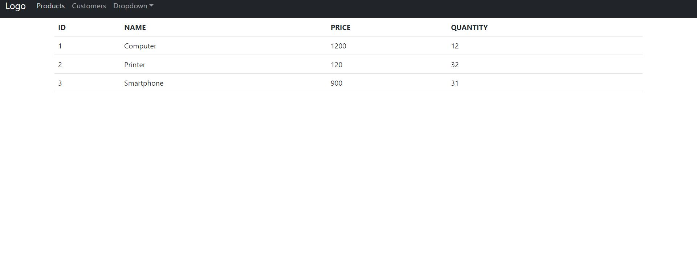
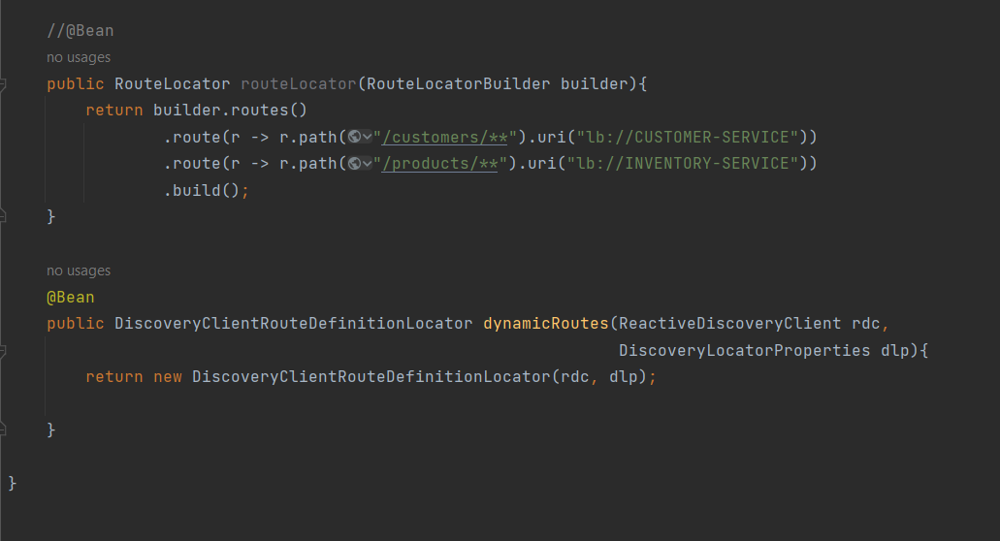
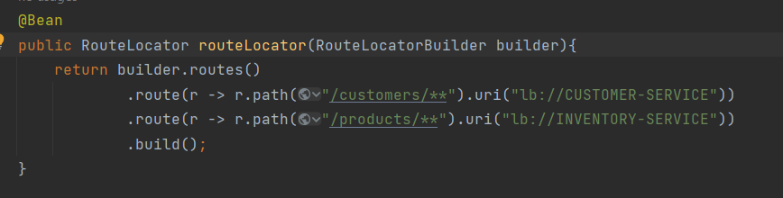
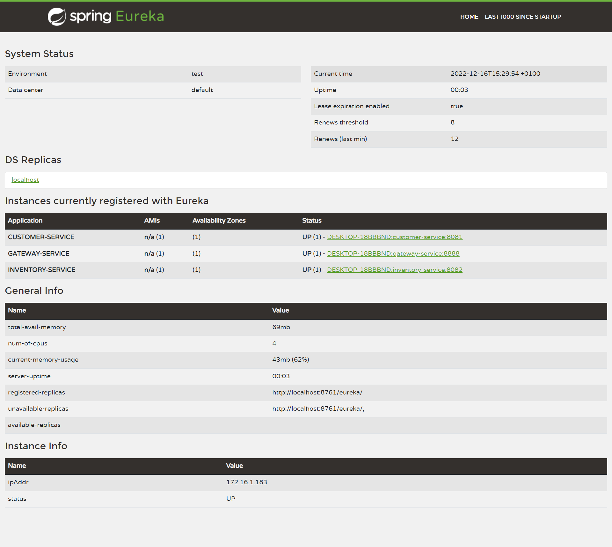
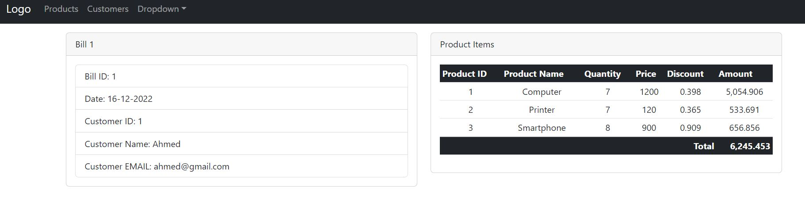

<h2>Customer-service<h2>

<h2>Inventory-service<h2>

<h2>Gateway<h2>

<h2>Configuration statique du système de routage<h2>

<h2>Eureka Discrovery Service<h2>

<h2>Configuration dynamique des routes de la gateway<h2>

<h2>Billing-Service<h2>

